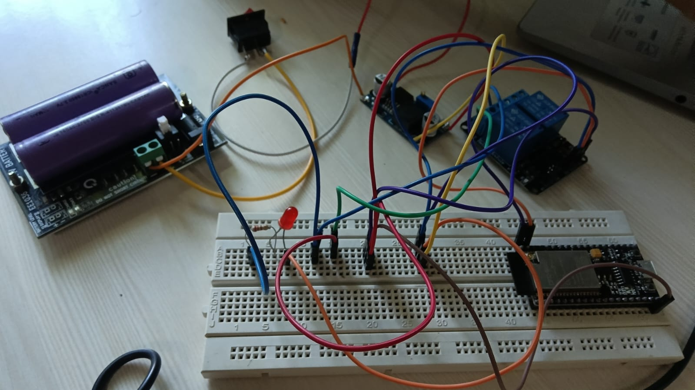
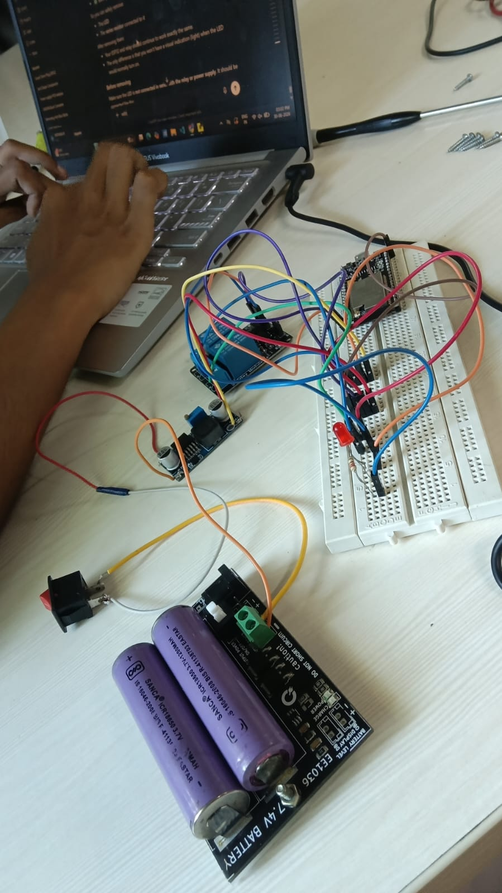
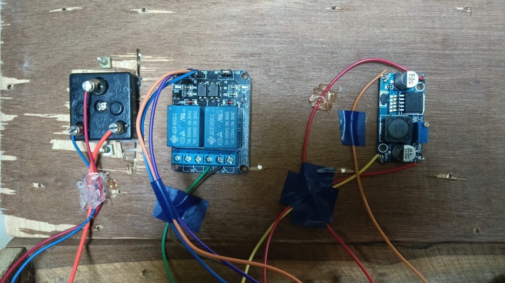
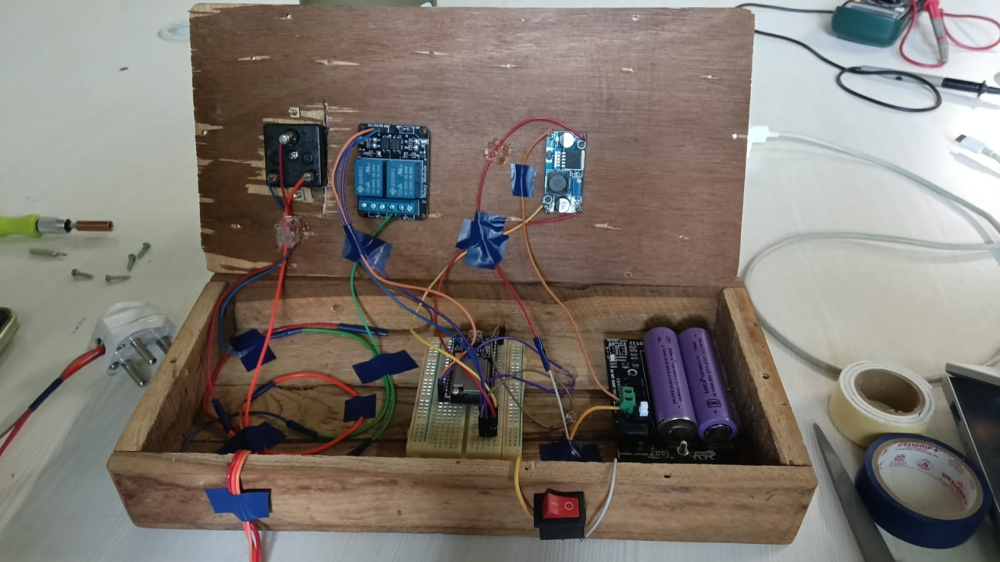
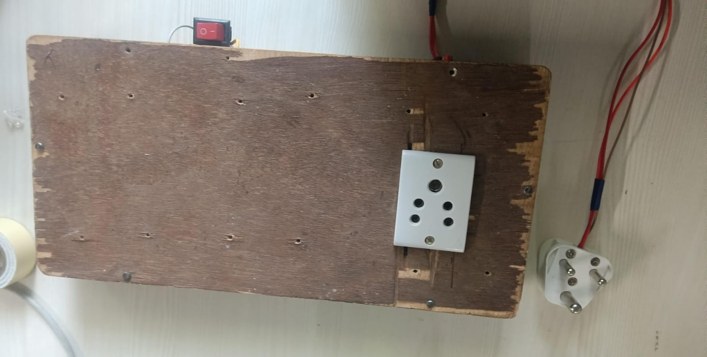

# 🔌 Smart Timer Plug using ESP32 & Blynk IoT


An IoT-based Smart Timer Plug designed to remotely control electrical appliances using the **Blynk IoT platform**. The system allows users to switch connected devices ON/OFF from anywhere, schedule automatic operations using timers, and monitor the device through a Wi-Fi connection.

---

## 📖 Project Overview

This project uses an **ESP32 WROVER-IE Module** to control a relay module connected to an AC appliance. The ESP32 communicates with the Blynk cloud, enabling users to operate the appliance remotely through the Blynk mobile application.

The LM2596 DC-DC Buck Converter provides a regulated power supply to the ESP32, ensuring stable operation.

---

## ✨ Features

- 📱 Remote ON/OFF control using Blynk IoT
- ⏰ Timer scheduling for automatic switching
- 🌐 Wi-Fi based operation
- ⚡ Relay-controlled AC appliance switching
- 🔋 Battery-powered operation 
- 🔒 Low-voltage control for user safety

---

## 🛠 Hardware Components

| Component | Quantity |
|-----------|---------:|
| ESP32 Wrover Module | 1 |
| 2-Channel Relay Module | 1 |
| LM2596 DC-DC Buck Converter | 1 |
| 12V Battery / DC Supply | 1 |
| AC Socket | 1 |
| Switch | 1 |
| Connecting Wires | As required |
| Wooden Enclosure | 1 |

---

## 💻 Software Used

- Arduino IDE
- Blynk IoT Platform
- ESP32 Board Package
- Blynk Library

---

## 📂 Repository Structure

```
Smart-Timer-Plug/
│
├── README.md
├── Smart_Timer_Plug_Final.ino
└── Images/
    ├── Components.jpeg
    ├── ESP32 Wrover-IE Module.jpeg
    ├── LM2596 DC-DC Buck Converter Module.jpeg
    ├── 2-Channel Relay Module.jpeg
    ├── Battery.jpeg
    ├── BreadboardConnection.jpeg
    ├── BreadboardConnection2.jpeg
    ├── Connection-Relay-LM2596.jpeg
    ├── FullConnection.jpeg
    ├── Switch-VoltageRegulator.jpeg
    └── WoodenBox.jpeg
```

---

## 📸 Project Images

### ESP32 Wrover Module


---

### Relay Module


---

### LM2596 Buck Converter


---

### Breadboard Connections





---

### Relay & Voltage Regulator Connections



---

### Complete Wiring



---

### Wooden Enclosure



---

## 🚀 Getting Started

1. Install Arduino IDE.
2. Install the ESP32 Board Package.
3. Install the Blynk Library.
4. Open `Smart_Timer_Plug_Final.ino`.
5. Update the following:
   - Blynk Authentication Token
   - Wi-Fi SSID
   - Wi-Fi Password
6. Select the ESP32 board & port.
7. Upload the code.
8. Open the Blynk app and control your smart plug.

---

## ⚠️ Safety Notice

This project interfaces with **AC mains voltage** through a relay module.

- Always disconnect the power before wiring.
- Use proper insulation.
- Never touch exposed AC terminals while powered.
- Test the circuit carefully before regular use.

---

## 🎯 Applications

- Mobile Charging
- Home Automation
- Smart Lighting
- Remote Appliance Control
- Energy Saving
- Educational IoT Projects

---
## 📄 Copyright Notice

This project is shared for educational and portfolio purposes only.

No license is granted for reuse, modification, or redistribution without the author's prior written permission.

© 2026 Gopika R. All rights reserved.

---

## 👩‍💻 Author

**Gopika R**

Electronics & Communication Engineering Student

GitHub: https://github.com/GopikaR06-collab

---
